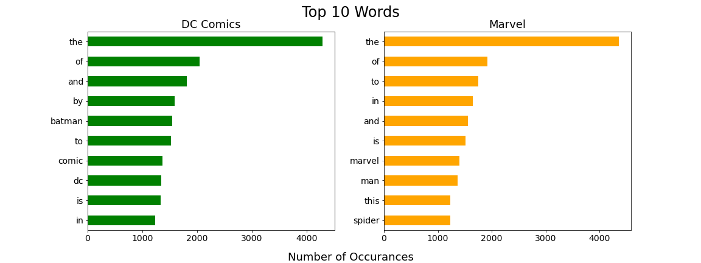
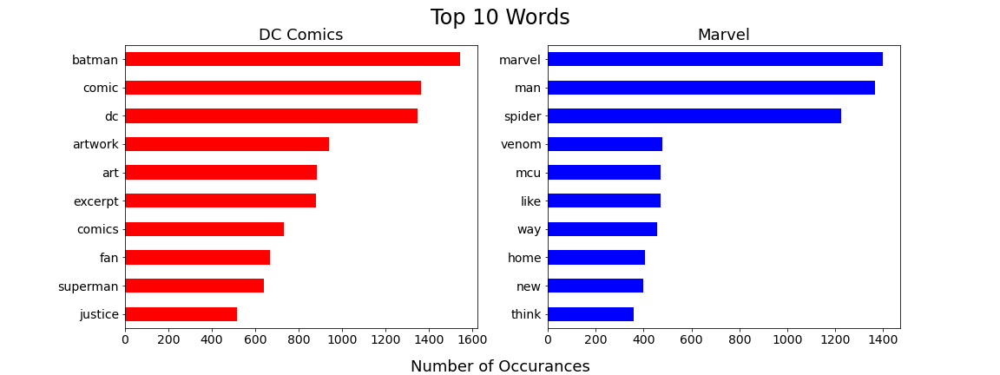
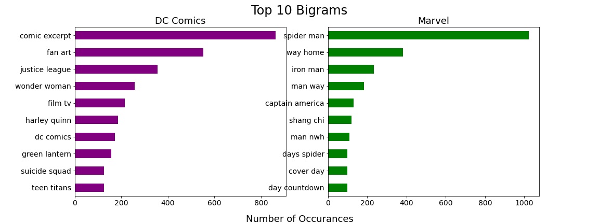
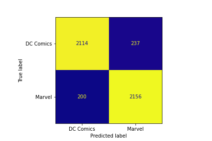

# Web APIs & NLP

## Contents

- Part 1: [Data Collection](https://git.generalassemb.ly/schen325/dsir-111/blob/master/projects/project-03/FINAL/part_1.ipynb)
- Part 2: [Data Cleaning, EDA, Preprocessing](https://git.generalassemb.ly/schen325/dsir-111/blob/master/projects/project-03/FINAL/part_2.ipynb)
- Part 3: [Modeling and Evaluation](https://git.generalassemb.ly/schen325/dsir-111/blob/master/projects/project-03/FINAL/part_3.ipynb)

## Executive Summary

### Problem Statement

This project seeks to build and train a model to predict the correct subreddit origin of a given post by utilizing text collected from the two subreddits. The two subreddits chosen for this project are DC comics and Marvel. Equal amounts of submissions were collected from each subreddit, using the submission title to train and test the models.  

### Data Import and Cleaning

Using Pushshift's API, posts are collected from two subreddits ([source](https://github.com/pushshift/api)). Data was pulled 100 times collecting 100 posts each time. Post titles were tokenized and lemmatized with english stop words removed. In addition, null values and duplicates were dropped. The final dataset is clean and complete consisting of 18827 rows and 2 columns of which one is the title and the name of the subreddict the post came from. 

### Dataset Dictionary
|Feature|Type|Dataset|Description|
|---|---|---|---|
|subreddit|int|cleaned_subreddit_data|Subreddit the submission belongs to where 0 is DC Comics and 1 is Marvel|
|subreddit|object|subreddit_data|Subreddit the submission belongs to.|
|title|object|cleaned_subreddit_data|Submission title|
|title|object|subreddit_data|Submission title|

### Exploratory Data Analysis

Top ten words of each subreddit: 

Top ten words with English stop words removed:

Top ten bigrams with English stop words removed:

70% of the top ten words are English stop words. Once stop words are removed, the top ten words contains more words that are specific to each subreddit. In addition, using bigrams, it returns words that are more significant to the subreddit. Taking into consideration of the new Spiderman movie, Marvel's top ten includes bigrams related to Spiderman. 

### Conclusions and Recommendations

Scores for each model:

| Model                                                          | Training Score | Testing Score |
|----------------------------------------------------------------|----------------|---------------|
| CountVectorizer Multinomial Naive Bayes w/ default parameter   | 0.9472         | 0.9089        |
| CountVectorizer Multinomial Naive Bayes w/ GridSearch          | 0.9296         | 0.9072        |
| TfidfVectorizer Multinomial Naive Bayes w/ default parameters  | 0.9500         | 0.9040        |
| TfidfVectorizer Multinomial Naive Bayes w/ GridSearch          | 0.9340         | 0.9034        |
| CountVectorizer Bernoulli Naive Bayes w/ default parameters    | 0.9470         | 0.9124        |
| CountVectorizer Bernoulli Naive Bayes w/ GridSearch            | 0.9310         | 0.9080        |
| TfidfVectorizer Bernoulli Naive Bayes w/ default parameters    | 0.9470         | 0.9124        |
| TfidfVectorizer Bernoulli Naive Bayes w/ GridSearch            | 0.9310         | 0.9080        |
| CountVectorizer Random Forests w/ default parameters           | 0.9996         | 0.8944        |
| CountVectorizer Random Forests w/ GridSearch                   | 0.9996         | 0.8955        |
| TfidfVectorizer Random Forests w/ default parameters           | 0.9996         | 0.8987        |
| TfidfVectorizer Random Forests w/ GridSearch                   | 0.9996         | 0.9031        |
| CountVectorizer ExtraTrees w/ default parameters               | 0.9996         | 0.8999        |
| CountVectorizer ExtraTrees w/ GridSearch                       | 0.9996         | 0.8997        |
| TfidfVectorizer ExtraTrees w/ default parameters               | 0.9996         | 0.9074        |
| TfidfVectorizer ExtraTrees w/ GridSearch                       | 0.9996         | 0.9084        |

Confusion Matrix using the best scoring model: 

The best model was the Multinomial Naive Bayes with CountVectorizer with GridSearch. It is the least overfit model with high accuracy on the testing set. The model is slightly overfit with training score of 93% and testing score of 91%. Surprisingly, Bernoulli Naive Bayes performed the same with CountVectorizer and TfidfVectorizer. GridSearch did help a little with the model overfitting. Random Forests and ExtraTrees models came out to be very over fit with training accuracy at 99.96% and testing at ~90%. GridSearch did not help much with overfitting. It helped with the testing accuracy but not significant. 

The model will be able to predict a posts subreddit with very good accuracy. For future projects, I would like to explore additional classifiers and parameters. In addition, change the way data was pulled. For example, limiting to 100 posts a day and not just the most recent posts and increase data size. 
